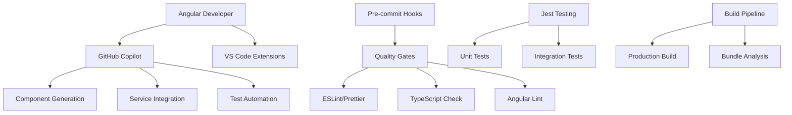

# AI Agents & Development Automation

This document outlines the AI agents, automated workflows, and development assistance tools used in the **3D Inventory Angular UI** project.

## Table of Contents

1. [Overview](#overview)
2. [GitHub Copilot Integration](#github-copilot-integration)
3. [AI-Assisted Angular Development](#ai-assisted-angular-development)
4. [Automated Quality Gates](#automated-quality-gates)
5. [Testing Automation](#testing-automation)
6. [Component Generation](#component-generation)
7. [Code Analysis & Optimization](#code-analysis--optimization)
8. [Documentation Generation](#documentation-generation)
9. [Deployment Automation](#deployment-automation)
10. [Monitoring & User Analytics](#monitoring--user-analytics)
11. [Best Practices](#best-practices)

## Overview

The **3D Inventory Angular UI** (`3d-inventory-angular-ui`) leverages advanced AI agents and automation tools to enhance frontend development productivity, code quality, and user experience. This project serves as the interactive interface for the 3D inventory management system.

### Frontend Architecture Components



## GitHub Copilot Integration

### Primary Use Cases for Angular Development

#### 🎨 **Angular Component Generation**

- **Standalone Components**: Modern Angular 17+ standalone component architecture
- **Reactive Forms**: Complex form generation with validation
- **Service Integration**: HTTP service integration with proper error handling
- **Route Guards**: Authentication and authorization guards
- **Pipes & Directives**: Custom Angular pipes and directives

#### 🔧 **Service Layer Development**

- **HTTP Services**: RESTful API integration with proper TypeScript typing
- **Authentication Service**: JWT token management and user state
- **State Management**: BehaviorSubject-based reactive state management
- **Error Handling**: Comprehensive error handling and user feedback

#### 🧪 **Testing Automation**

- **Component Tests**: Angular TestBed-based component testing
- **Service Tests**: HTTP service testing with MockHttpClient
- **Integration Tests**: End-to-end user workflow testing
- **Authentication Testing**: Login flow testing (see `test-login-functionality.js`)

### Implementation Examples

#### AI-Generated Authentication Testing

```javascript
// File: test-login-functionality.js
const testCredentials = [
  { username: 'admin', password: 'admin123!', role: 'admin' },
  { username: 'user', password: 'user123!', role: 'user' },
  { username: 'carlo', password: 'carlo123!', role: 'user' },
  { username: 'viewer', password: 'viewer123!', role: 'viewer' },
]

async function testLoginUI(username, password) {
  // AI-generated UI testing logic
  const usernameInput = document.querySelector('input[formControlName="username"]')
  const passwordInput = document.querySelector('input[formControlName="password"]')
  const submitButton = document.querySelector('button[type="submit"]')

  // Form interaction and validation testing
}
```

#### AI-Assisted Angular Service Testing

```typescript
// File: src/app/tests/login-functionality.spec.ts
describe('Login Functionality Tests', () => {
  let service: AuthenticationService
  let httpMock: HttpTestingController

  // Comprehensive test suite covering:
  // - Angular service testing
  // - HTTP client mocking
  // - State management verification
  // - Error handling scenarios
})
```

## AI-Assisted Angular Development

### Angular-Specific Development Phases

#### 1. **Component Architecture Planning**

- **AI Consultation**: Component structure and lifecycle optimization
- **Dependency Injection**: Service dependency analysis and injection
- **Template Design**: HTML template generation with Angular directives

#### 2. **Reactive Programming**

- **Observable Patterns**: RxJS operator selection and chaining
- **State Management**: BehaviorSubject and reactive state patterns
- **Change Detection**: OnPush strategy optimization

#### 3. **Form Development**

- **Reactive Forms**: FormBuilder and validation implementation
- **Custom Validators**: Business logic validation rules
- **Error Handling**: User-friendly error messaging

#### 4. **Routing & Navigation**

- **Lazy Loading**: Feature module lazy loading implementation
- **Route Guards**: Authentication and authorization guards
- **Navigation**: Programmatic navigation with state preservation

## Automated Quality Gates

### Angular-Specific Pre-commit Automation

```bash
# Automated quality checks for Angular project
# Defined in package.json scripts
#!/bin/sh
npm run lint              # Angular ESLint with Angular-specific rules
npm run lint:prettier     # Prettier formatting for TypeScript/HTML
npm run test             # Jest unit tests
npm run version:patch    # Automatic version bumping
```

### Angular Build Quality Checks

```bash
# Production build validation
npm run build:prod       # Production build verification
npm run build:analyze    # Bundle size analysis
npm run lint:check       # Strict linting without auto-fix
npm run security:check   # Security audit
```

### Quality Metrics Tracking

- **Test Coverage**: Jest coverage reporting (>80% threshold)
- **Bundle Size**: Webpack bundle analyzer integration
- **Angular Performance**: Build-time analysis and optimization
- **Accessibility**: Angular CDK a11y compliance

## Testing Automation

### Angular Testing Categories

#### **Component Testing**

```typescript
// AI-generated Angular component tests
describe('LoginComponent', () => {
  let component: LoginComponent
  let fixture: ComponentFixture<LoginComponent>
  let authServiceSpy: jasmine.SpyObj<AuthenticationService>

  beforeEach(async () => {
    // TestBed configuration with proper mocking
    await TestBed.configureTestingModule({
      imports: [LoginComponent, ReactiveFormsModule],
      providers: [{ provide: AuthenticationService, useValue: authServiceSpy }],
    }).compileComponents()
  })

  it('should redirect if already authenticated', () => {
    // Authentication flow testing
  })
})
```

#### **Service Testing**

```typescript
// Angular service testing with HTTP mocking
describe('AuthenticationService', () => {
  let service: AuthenticationService
  let httpMock: HttpTestingController

  it('should login successfully and update auth state', () => {
    const loginRequest: LoginRequest = { username: 'carlo' }
    const mockResponse: LoginResponse = { token: 'mock.jwt.token' }

    service.login(loginRequest).subscribe((response) => {
      expect(response).toEqual(mockResponse)
      expect(service.isAuthenticated()).toBeTruthy()
    })

    const req = httpMock.expectOne('http://localhost:8080/login')
    req.flush(mockResponse)
  })
})
```

#### **Integration Testing**

```javascript
// Browser-based integration testing
describe('User Management Workflow', () => {
  it('should create, edit, and delete users', async () => {
    // Complete user management workflow testing
  })
})
```

### Test Automation Pipeline

1. **Component Testing**: Angular TestBed-based component isolation
2. **Service Testing**: HTTP service testing with proper mocking
3. **Browser Testing**: Real browser interaction testing
4. **Accessibility Testing**: Angular CDK a11y integration

## Component Generation

### AI-Assisted Angular Component Development

#### **Standalone Component Generation**

```typescript
// AI-generated Angular 17+ standalone component
@Component({
  selector: 'app-user-form',
  standalone: true,
  imports: [CommonModule, ReactiveFormsModule],
  templateUrl: './user-form.component.html',
  styleUrls: ['./user-form.component.scss'],
  changeDetection: ChangeDetectionStrategy.OnPush,
})
export class UserFormComponent implements OnInit, OnDestroy {
  // AI-generated reactive form implementation
  // Proper lifecycle management
  // Service integration with error handling
}
```

#### **Service Integration**

```typescript
// AI-generated Angular service with HTTP client
@Injectable({
  providedIn: 'root',
})
export class AuthenticationService {
  private readonly API_URL = environment.baseurl
  private authStateSubject = new BehaviorSubject<AuthState>({
    isAuthenticated: false,
    user: null,
    token: null,
  })

  login(loginRequest: LoginRequest): Observable<LoginResponse> {
    // AI-generated HTTP service implementation
    // Proper error handling and state management
  }
}
```

#### **Template Generation**

```html
<!-- AI-generated Angular template with proper directives -->
<form [formGroup]="loginForm" (ngSubmit)="onSubmit()">
  <div class="form-group">
    <label for="username">Username</label>
    <input
      id="username"
      type="text"
      formControlName="username"
      [class.is-invalid]="hasFieldError('username')"
      class="form-control" />
    @if (hasFieldError('username')) {
    <div class="invalid-feedback">{{ getFieldError('username') }}</div>
    }
  </div>
</form>
```

## Code Analysis & Optimization

### Angular-Specific Analysis Tools

#### **ESLint Configuration for Angular**

```typescript
// Angular-specific ESLint configuration
export default [
  {
    files: ['**/*.ts'],
    extends: ['@angular-eslint/recommended', '@angular-eslint/template/process-inline-templates'],
    rules: {
      '@angular-eslint/directive-selector': [
        'error',
        {
          type: 'attribute',
          prefix: 'app',
          style: 'camelCase',
        },
      ],
      '@angular-eslint/component-selector': [
        'error',
        {
          type: 'element',
          prefix: 'app',
          style: 'kebab-case',
        },
      ],
    },
  },
]
```

#### **Bundle Analysis & Optimization**

```bash
# AI-assisted bundle optimization
npm run build:analyze     # Webpack bundle analyzer
npm run build:verbose     # Detailed build information
npm run check:depcheck    # Unused dependency detection
npm run check:upgrade     # Dependency update analysis
```

### Performance Optimization

- **OnPush Change Detection**: AI-recommended change detection strategy
- **Lazy Loading**: Automatic route-based code splitting
- **Tree Shaking**: Dead code elimination analysis
- **Bundle Splitting**: Vendor and application code separation

## Documentation Generation

### Angular-Specific Documentation

#### **Component Documentation**

```bash
# Automated Angular documentation generation
npm run compodoc:serve    # Compodoc documentation server
# Generates comprehensive component documentation
# Including dependency graphs, coverage reports
```

#### **API Integration Documentation**

- **Service Documentation**: HTTP service endpoint documentation
- **Interface Documentation**: TypeScript interface definitions
- **Component Usage**: Angular component usage examples
- **Testing Guides**: Angular testing best practices

#### **Architecture Documentation**

````typescript
/**
 * User Management Service
 *
 * Handles all user-related operations including:
 * - User authentication and authorization
 * - CRUD operations for user management
 * - Permission validation and role-based access
 *
 * @example
 * ```typescript
 * constructor(private userService: UserService) {}
 *
 * ngOnInit() {
 *   this.userService.getUsers().subscribe(users => {
 *     this.users = users;
 *   });
 * }
 * ```
 */
@Injectable({ providedIn: 'root' })
export class UserService {
  // Implementation
}
````

## Deployment Automation

### Angular Build & Deployment Pipeline

#### **GitHub Actions for Angular**

```yaml
# .github/workflows/angular-deploy.yml
name: Angular CI/CD Pipeline
on:
  push:
    branches: [main]
jobs:
  build-and-test:
    runs-on: ubuntu-latest
    steps:
      - name: Checkout code
        uses: actions/checkout@v3

      - name: Setup Node.js
        uses: actions/setup-node@v3
        with:
          node-version: '18'

      - name: Install dependencies
        run: npm ci

      - name: Run linting
        run: npm run lint:check

      - name: Run tests
        run: npm run test -- --coverage --watchAll=false

      - name: Build production
        run: npm run build:prod

      - name: Deploy to Google Cloud
        run: npm run gcp:build
```

#### **Google Cloud Deployment**

```bash
# Automated deployment scripts
npm run gcp:build        # Build and deploy to GCP
./build.sh              # Production build script
./deploy.sh             # Deployment automation
```

### Docker Integration

```dockerfile
# Multi-stage Angular build
FROM node:18-alpine as build
WORKDIR /app
COPY package*.json ./
RUN npm ci --only=production
COPY . .
RUN npm run build:prod

FROM nginx:alpine
COPY --from=build /app/dist /usr/share/nginx/html
COPY default.conf /etc/nginx/conf.d/default.conf
```

## Monitoring & User Analytics

### Frontend Monitoring

#### **User Experience Monitoring**

```typescript
// AI-enhanced user experience tracking
@Injectable({ providedIn: 'root' })
export class AnalyticsService {
  trackUserInteraction(component: string, action: string) {
    // User interaction tracking
    // Performance metrics collection
    // Error reporting and analysis
  }

  trackPageLoad(route: string, loadTime: number) {
    // Page load performance tracking
    // Route-based analytics
  }
}
```

#### **Error Tracking & Reporting**

```typescript
// Angular error handler with automated reporting
@Injectable()
export class GlobalErrorHandler implements ErrorHandler {
  handleError(error: any): void {
    // AI-enhanced error categorization
    // Automatic error reporting
    // User-friendly error messaging
  }
}
```

### Performance Analytics

- **Core Web Vitals**: LCP, FID, CLS monitoring
- **Angular Performance**: Change detection cycles, bundle size
- **User Journey**: Navigation patterns and user flow analysis
- **API Performance**: HTTP request timing and error rates

## Best Practices

### Angular AI Agent Integration

#### **Component Development Guidelines**

1. **Standalone Components**: Use Angular 17+ standalone architecture
2. **OnPush Strategy**: Implement OnPush change detection for performance
3. **Reactive Forms**: Prefer reactive forms over template-driven forms
4. **Type Safety**: Maintain strict TypeScript configuration

#### **Quality Standards**

```typescript
// AI-assisted Angular code should meet these standards:
interface AngularQualityStandards {
  components: 'standalone' // Angular 17+ standalone components
  changeDetection: 'OnPush' // Performance-optimized change detection
  forms: 'reactive' // Reactive forms with validation
  testing: 'comprehensive' // Jest + TestBed testing
  accessibility: 'WCAG-compliant' // Angular CDK a11y integration
  performance: 'optimized' // Bundle size and runtime optimization
}
```

### Angular Development Workflow

#### **Daily Development Process**

1. **Component Planning**: AI-assisted component architecture design
2. **Implementation**: Real-time Angular-specific code completion
3. **Testing**: Automated Angular component and service testing
4. **Build Verification**: Automated build and bundle analysis

#### **Angular-Specific Patterns**

- **Dependency Injection**: Proper service injection and scoping
- **Reactive Programming**: RxJS operators and observable patterns
- **State Management**: BehaviorSubject-based state management
- **Route Management**: Lazy loading and route guards

### Continuous Improvement

#### **Angular Learning Loop**

1. **Component Patterns**: AI learns from Angular component structures
2. **Performance Optimization**: Bundle size and runtime performance analysis
3. **User Experience**: User interaction patterns and optimization
4. **Testing Patterns**: Angular-specific testing best practices

## Configuration Files

### Angular-Specific Configuration

- **`angular.json`**: Angular CLI workspace configuration
- **`eslint.config.js`**: Angular ESLint rules and configuration
- **`jest.config.ts`**: Jest testing configuration for Angular
- **`tsconfig.json`**: TypeScript configuration with Angular optimizations
- **`tsconfig.spec.json`**: TypeScript configuration for testing

### Build and Development Scripts

```json
{
  "scripts": {
    "start": "npm run cp && ng serve",
    "build": "ng build 3d-inventory-angular-ui",
    "build:prod": "ng build 3d-inventory-angular-ui --configuration=production",
    "test": "jest",
    "lint": "ng lint",
    "lint:prettier": "prettier --write src/**/*.ts",
    "prestart": "npx kill-port 4200 && npm version patch --no-git-tag-version"
  }
}
```

## Future Enhancements

### Planned Angular AI Integrations

1. **Angular Universal**: Server-side rendering with AI optimization
2. **PWA Features**: Progressive Web App capabilities with AI assistance
3. **Micro-frontends**: Module federation and micro-frontend architecture
4. **Angular Signals**: Migration to Angular Signals for reactive programming

### Angular Roadmap

- **Q1 2025**: Angular 18+ migration with AI assistance
- **Q2 2025**: Advanced PWA features and offline capabilities
- **Q3 2025**: Micro-frontend architecture implementation
- **Q4 2025**: Full Angular Signals adoption

## Resources

### Angular-Specific Documentation

- [Angular Official Documentation](https://angular.io/docs)
- [Angular Testing Guide](https://angular.io/guide/testing)
- [Angular Performance Guide](https://angular.io/guide/performance-guide)
- [Angular Accessibility](https://angular.io/guide/accessibility)

### Development Tools

- **Angular CLI**: Project scaffolding and build tools
- **Angular DevTools**: Browser extension for Angular debugging
- **Compodoc**: Angular documentation generation
- **Jest**: Testing framework with Angular integration
- **ESLint**: Angular-specific linting rules

### Testing Resources

- **[AI Testing Integration](../3d-inventory-api/docs/troubleshooting/archive/AI-TESTING-INTEGRATION.md)**: Cross-project testing strategy
- **test-login-functionality.js**: Browser-based login testing
- **src/app/tests/**: Comprehensive Angular test suites
- **Angular TestBed**: Component testing framework
- **HTTP Testing**: Angular HTTP client testing utilities

### Related Backend Documentation

- **[API Agents Guide](../3d-inventory-api/AGENTS.md)**: Backend AI automation
- **[API Testing Guide](../3d-inventory-api/JEST-TESTING.md)**: Backend testing framework
- **[Database Auth Testing](../3d-inventory-api/test-db-auth.ts)**: Authentication verification

---

_This document is maintained by the AI-assisted Angular development workflow and is automatically updated as new agents and automation tools are integrated into the 3D Inventory UI project._
