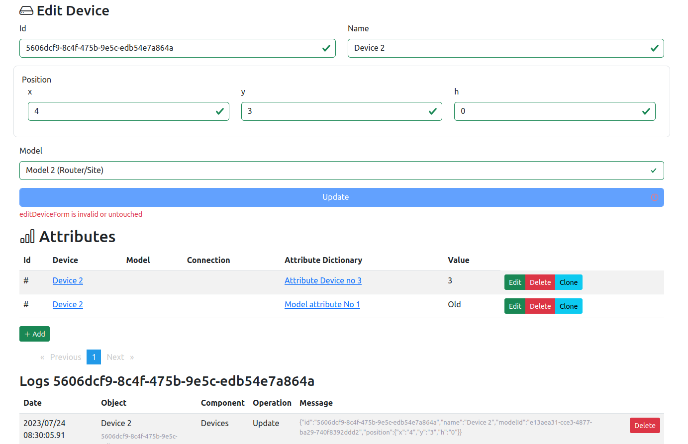

# 3d inventory

- [3d inventory](#3d-inventory)
  - [About project](#about-project)
  - [Motivation](#motivation)
  - [Technology stack](#technology-stack)
  - [Demo](#demo)
  - [Data Model](#data-model)
    - [Entity model](#entity-model)
    - [Logical model](#logical-model)
    - [Entity attributes](#entity-attributes)
  - [Current functionality](#current-functionality)
    - [List devices](#list-devices)
    - [Models](#models)
    - [Attributes](#attributes)
    - [Attribute Dictionary](#attribute-dictionary)
    - [Connections](#connections)
    - [Application 3d view](#application-3d-view)
  - [Run](#run)
  - [Upgrades dependences](#upgrades-dependences)
  - [Debug](#debug)
  - [Deploy](#deploy)
    - [AWS](#aws)
  - [Json server](#json-server)
  - [Swagger client to generate API structures](#swagger-client-to-generate-api-structures)
  - [APIs](#apis)
    - [Oracle](#oracle)
    - [Mongo](#mongo)
  - [Contributing](#contributing)
  - [Next todo](#next-todo)

[](https://wakatime.com/badge/user/3bbeedbe-0c6a-4a01-b3cd-a85d319a03bf/project/018c62ce-6164-4200-bca9-be53af7f6d80) [](https://GitHub.com/karol-preiskorn/3d-inventory-angular-ui/commit/) [](https://GitHub.com/karol-preiskorn/3d-inventory-angular-ui/stargazers/) [](https://GitHub.com/karol-preiskorn/3d-inventory-angular-ui/issues/)
[](https://lbesson.mit-license.org/) [](https://www.typescriptlang.org/) [](https://https://npmjs.com/) [](https://github.com/karol-preiskorn/3d-inventory-angular-ui/blob/master/LICENSE)

## About project

Project create `3d inventory`. A simple solution that allows you to build a spatial and database representation of all types of warehouses and server rooms.

## Motivation

I'm programming to incorporate database systems. This project covers relevant topics and issues related to create simple and efficient platform for IT inventory.

## Technology stack

- `Angular` 15+ (as a Corp framework)
- `Bootstrap` 5.3+ - logic for insert `UI` data
- `Tree` 150+ (as best graph framework)
- [`Neo4j`|`Oracle`|`jsonserver`] `Oracle` as database (for development `json server` -> rest `Oracle` -> rest `Neo4j`. I want in this project try different solution and different data structure and storage.
- `REST` - prepared `API` in use in `Swagger`.
- [`Docker`|`OpenShift`|`Podman`|`GitHub Container`] as containers

## Demo


## Data Model

This is implementation parametric generic attribute class. All attributes for `Devices`, `Models` and `Connections` are stored in this model.

Parameters types are defined in `Attribute Dictionary`.

In `Attributes` are stored values defined in `Attributes Dictionary` for `Devices`, `Model` and `Connections`.

`Attributes Dictionary` are defined for specyfice.

### Entity model


### Logical model


### Entity attributes

- `MODELS`
  - ID (UUID4)
  - NAME
  - DIMENSION
    - X
    - Y
    - H
- `DEVICES`
  - ID (UUID4)
  - NAME
  - MODEL_ID
  - POSITION
    - X
    - Y
    - H
- `CONNECTION`
  - ID (UUID4)
  - TO_DEVICE_ID
  - FROM_DEVICE_ID
- `ATTRIBUTES`
  - ID (UUID4)
  - DEVICE_ID
  - MODEL_ID
  - CONNECTION_ID
  - ATTRIBUTE_TYPE_ID
  - VALUE
- `ATTRIBUTES_TYPES`
  - ID (UUID4)
  - NAME
  - DESCRIPTION
  - COMPONENTS (list of values)
- `FLOORS` (@TODO)
  - ARRAY SHAPE
    - DIMENSION
      - X
      - Y
      - H
    - POSITION
      - X
      - Y
      - H
    - ENTERS ARRAY
      - X
      - Y
      - H
      - TYPE [ENTER|EMPTY]
- `LOGS`
  - ID (UUID4)
  - DATETIME
  - OBJECT_ID (UUID4)
  - OPERATION
  - COMPONENT
  - MESSAGE

## Current functionality

- [Reactive forms](https://angular.io/guide/reactive-forms?ref=cup-t) in `Angular` 15+
- [Bootstrap 5.3](https://getbootstrap.com/)+ show
- `3D` representation in [three.js](https://threejs.org/) 150+
- Dynamic define attributes to components:
  - `DEVICES`
  - `MODELS`
  - `FLOORS`
  - `CONNECTIONS`
- Show dynamic attributes for `Device`: 

### List devices


#### Edit device


### Models


### Attributes


### Attribute Dictionary


### Connections


### Application 3d view

View in `3d` inventory use [three.js](https://threejs.org/) framework.


This project build from this example contain `three.js` in `Angular`[Tutorial to render 3D Cube in Angular + Three.js](https://srivastavaanurag79.medium.com/hello-cube-your-first-three-js-scene-in-angular-176c44b9c6c0).

## Run

```bash
# clone repo
git clone https://github.com/karol-preiskorn/3d-inventory-angular-ui.git
# install dependences
npm install
# run server
npm run start
# run data server
npm run start:json-server
# goto in browser
http://localhost:4200
```

On this stage of project I use single branch `master`. If I finish this stage when app will be usefully I will use also develop.

## Upgrades dependences

- For Ag <https://angular.io/guide/versions>
- All use `npm `

## Debug

Try use Firefox plugin in `VS code`. Without success i used Chronium.

- <https://github.com/microsoft/vscode-recipes/tree/main/Angular-CLI>

## Deploy

<https://angular.io/guide/deployment>

Build in first terminal: `ng build --watch` in npm alias:

```bash
npm run build
```

On the second terminal, install a web server (such as `lite-server`), and run it against the output folder. For example:

```bash
lite-server --baseDir='dist/3d-inventory-angular-ui/browser'
```

`npm` alias: `npm run server`

### AWS

```js
npm install -g @aws-amplify/cli
amplify configure
```

## Json server

For testing UI API run `jsonserver`.

In `npm` run script:

```js
"jsonserver:devices": "json-server --watch devices.json"
```

Server `url`:

```json
baseurl = 'http://localhost:3000';
```

Used by `.env` service `this.environmentServiceClass.getSettings('BASEURL')`.

## Swagger client to generate API structures

Abandoned until I do not have clear situation with data entity and operations. Now I use `json-swager` to store data.

```bash
ng generate library swagger-client
```

Generate library: `projects/swagger-client`

Copy to src all generated by `swaggercodegen` code

## APIs

### Oracle

[3d-inventory-oracle-api](https://github.com/karol-preiskorn/3d-inventory-oracle-api)

### Mongo

#### Mongo Atlas

One of good options `3d-inventory` data storage.

[3d-inventory-mongo-api](https://github.com/karol-preiskorn/3d-inventory-mongo-api)

#### MongoDB

Under consideration

## Contributing

Pull requests are welcome. For major changes, please open an [issue](https://github.com/karol-preiskorn/3d-inventory-angular-ui/issues/new) first to discuss what you would like to change.

Please make sure to update tests as appropriate.

Not forget about [code guide-lines](https://github.com/Microsoft/TypeScript/wiki/Coding-guidelines).

## Next todo

- [ ] connection between showing 3d and defined devices.
- [x] build interfance to Mongo Atlas
- [x] Set position and model in data ans show this data in `3d`.
- [ ] Show attributes of `DEVICES`, `MODELS` and `CONNECTIONS`.
- [x] Generate `FLOOR`
- [ ] as array of square (x, y, h)
- [ ] Use `Mongo` to strore `JSON` data. (starting)
- [ ] `Docker` -> serve application in `Github Pages` --> `AWS EC2`
- [ ] Use Dev container in `GitHub` for development.
- [ ] Recognize `Grunt`/`Glup` to `CI`/`DI` use in this project.
- [ ] Add actual tasks form `GitHub` during build in README.md.
- [x] Add light/dark theme switch in `UI`
- [ ] For development `JSON` server -> rest `Oracle` --> rest `Neo4j`
- [ ] Use <https://formly.dev/> ?
- [ ] Create blog on GitHub Pages
