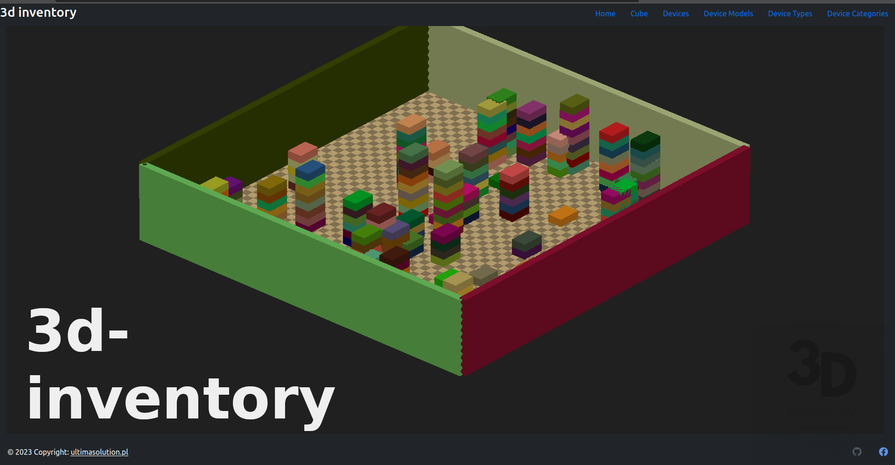

# 3d inventory

- [3d inventory](#3d-inventory)
  - [About project](#about-project)
  - [Technology stack](#technology-stack)
  - [Demo](#demo)
  - [Data Model](#data-model)
    - [Logical model](#logical-model)
  - [Aplication](#aplication)
    - [List devices](#list-devices)
    - [Models](#models)
    - [Attributes](#attributes)
    - [Attribute Dictionary](#attribute-dictionary)
    - [Connections](#connections)
  - [Run](#run)
  - [Deploy](#deploy)
  - [Google Cloud](#google-cloud)
  - [APIs repos](#apis-repos)
  - [Contributing](#contributing)
  - [Next todo](#next-todo)

[](https://wakatime.com/badge/user/3bbeedbe-0c6a-4a01-b3cd-a85d319a03bf/project/018c62ce-6164-4200-bca9-be53af7f6d80) [](https://GitHub.com/karol-preiskorn/3d-inventory-angular-ui/commit/) [](https://GitHub.com/karol-preiskorn/3d-inventory-angular-ui/stargazers/) [](https://GitHub.com/karol-preiskorn/3d-inventory-angular-ui/issues/)
[](https://lbesson.mit-license.org/) [](https://www.typescriptlang.org/) [](https://https://npmjs.com/) [](https://github.com/karol-preiskorn/3d-inventory-angular-ui/blob/master/LICENSE)

## About project

Project create ✨`3d inventory`✨— solution that allows you to build a spatial and database representation of yours datacenters.

    Motivation

    I'm programming to incorporate database systems. This project it is sandbox to covers relevant topics and issues related to create simple and efficient platform for IT inventory.


Project contain three repos:

- ⚓ https://github.com/karol-preiskorn/3d-inventory-angular-ui
- ⚓ https://github.com/karol-preiskorn/3d-inventory-mongo-api
- ⚓ https://github.com/karol-preiskorn/3d-inventory-oracle-api

## Technology stack

- `Angular` 17+ - as a Corp framework.
- `Bootstrap` 5.3+ - logic for insert `UI` data
- `tree.js` 163+ - as best graph framework.
- `MongoAtlas`|`Oracle` - I want in this project try different solution and different data structure and storage datamodels relational and noSQL.
- `REST` - prepared `API` in use in `Swagger`.
- `Podman` --> `Google Cloud` as containers

## Demo

Demo `3d inventory` use `Angular` and `three.js` framework for graphics representation.

[](https://youtu.be/rNOxpZ0ti1Q '3-d inventory the video')

This project build from this example contain `three.js` in `Angular` [Tutorial to render 3D 3d in Angular + Three.js](https://srivastavaanurag79.medium.com/hello-3d-your-first-three-js-scene-in-angular-176c44b9c6c0).

## Data Model

This is implementation parametric generic attribute class. All attributes for `Devices`, `Models` and `Connections` are stored in this model.

Parameters types are defined in `Attribute Dictionary`.

In `Attributes` are stored values defined in `Attributes Dictionary` for `Devices`, `Model` and `Connections`. `Attributes Dictionary` are defined for specyfice parameters this entities.

### Logical model

Relational data model is maped to noSQL model im MondoDb.


## Aplication

### List devices


### Models


### Attributes


### Attribute Dictionary


### Connections


## Run

```bash
git clone https://github.com/karol-preiskorn/3d-inventory-angular-ui.git
cd 3d-inventory-angular-ui
npm install
npm run start
```

or run separately `json-server` and `ui`

```bash
npm run start:json-server
npm run start:ng
```

Goto in browser http://localhost:4200

## Deploy

<https://angular.io/guide/deployment>

Build in first terminal: `ng build --watch` in npm alias:

```bash
npm run build
```

## Google Cloud

tbc

## APIs repos

- Oracle [3d-inventory-oracle-api](https://github.com/karol-preiskorn/3d-inventory-oracle-api)
- Mongo Atlas ✨ [3d-inventory-mongo-api](https://github.com/karol-preiskorn/3d-inventory-mongo-api)

## Contributing

Pull requests are welcome. For major changes, please open an [issue](https://github.com/karol-preiskorn/3d-inventory-angular-ui/issues/new) first to discuss what you would like to change.
Please make sure to update tests as appropriate.
Not forget about [code guide-lines](https://github.com/Microsoft/TypeScript/wiki/Coding-guidelines).

## Next todo

- [ ] connection between showing 3d and defined devices.
- [x] build interfance to Mongo Atlas
- [x] Set position and model in data ans show this data in `3d`.
- [ ] Show attributes of `DEVICES`, `MODELS` and `CONNECTIONS`. Waiting for MongoDB|Oracle API.
- [x] Generate `FLOOR`
- [ ] as array of square (x, y, h)
- [x] Use `Mongo` to strore `JSON` data. (starting)
- [x] `Docker` -> serve application in `Github Pages` --> `AWS EC2`
- [ ] Use Dev container in `GitHub` for development.
- [ ] Recognize `Grunt`/`Glup` to `CI`/`DI` use in this project.
- [x] Add actual tasks form `GitHub` during build in README.md.
- [x] Add light/dark theme switch in `UI`
- [ ] Use <https://formly.dev/> ?
- [ ] Create blog on GitHub Pages or use <https://ultimasolution.pl>
